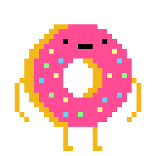
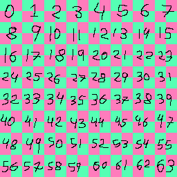
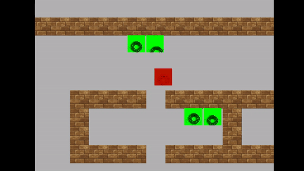

# Trabajo Final | ANIMATIONS
## Integrantes
* u201920609 | Gonzales De La Cruz, Grober Ericson
* | Wu Pan, Tito

Para el trabajo final se agregó una clase que se encarga de animar los sprites haciendo uso de los UV.

Personaje que se intentará importar en el proyecto.
> 

## Clase Animator

```cpp
#include <vector>
#include <glm/glm.hpp>

class Animator
{
protected:
	int split, index;
	int animation;
	long counter;
	long frames;
	std::vector<std::vector<int>> animations;

public:
	Animator();
	Animator(int split, long frames);
	~Animator();

	void addAnimation(const std::vector<int>& newAnimation);
	void setFrames(long speed);
	void setAnimation(int index);
	void update();
	glm::vec4 getUV();
};
```
### Atributos
* **split**: divisiones de la imagen (cortes).
* **index**: índices actual del corte de la imagen (el indice es unidimesional y puede retresentar cualquier corte de la imagen original).
* **animations**: el la lista de animaciones, cada animacion es una vector de indices.
* **animation**: indica que animación se está usando.
* **counter**: variable auxiliar para hacer el conteo del tiempo en frames que se mostrará un frame.
* **frames**: es el tiempo que se motrastrará un frame.
### Métodos
* **Animator**: Instanciar con la configuración *default*
* **Animator(int split, long frames)**: Iniciar con una configuración personalizada.
* **addAnimation**: Se agrega un nuevo vector de animación.
* **setFrames**: Setter de *frames*
* **setAnimation**: Setter de *animation*
* **update**: método que se encarga de actualizar los frames.
* **getUV**: Obtiene el UV que puede ser usando en un sprite para mostrar el corte de la imagen (frame).

## Implementación
Para simplificar la implementación, se optó por incorporar a cada Agente un objeto `animator` y ponerle una configuración inicial.
```cpp
class Agent
{
protected:
	Animator animator;
public:
	Agent();
	virtual void draw(SpriteBatch& spriteBatch);
}

Agent::Agent()
{
    animator = Animator(5, 10);
    animator.addAnimation({ 0, 1, 2, 3, 4, 5, 4, 3, 2, 1 });
    animator.setAnimation(1);
}
void Agent::draw(SpriteBatch& spriteBatch)
{
    animator.update();
    static int textureID = ResourceManager::getTexture(path).id;
    const glm::vec4 uvRect = animator.getUV();
    glm::vec4 destRect(position.x, position.y, AGENT_WIDTH, AGENT_WIDTH);
    spriteBatch.draw(destRect, uvRect, textureID, 0.0f, color);
}
```
La configuración mostrada en el código significa que el objeto `animator` incia como un sprite de 5x5 frames y que cada frame tendrá un tiempo de 10 iteraciones para mostrarse.
La animación configurada es una que hace un loop de una fila.
Se selecciona la animación recien creada.
## Formato de la imagen
Las texturas necesarias deben de ser conformadas por imágenes cuadradas que componen una imagen cuadrada final.
> 

## Pruebas

