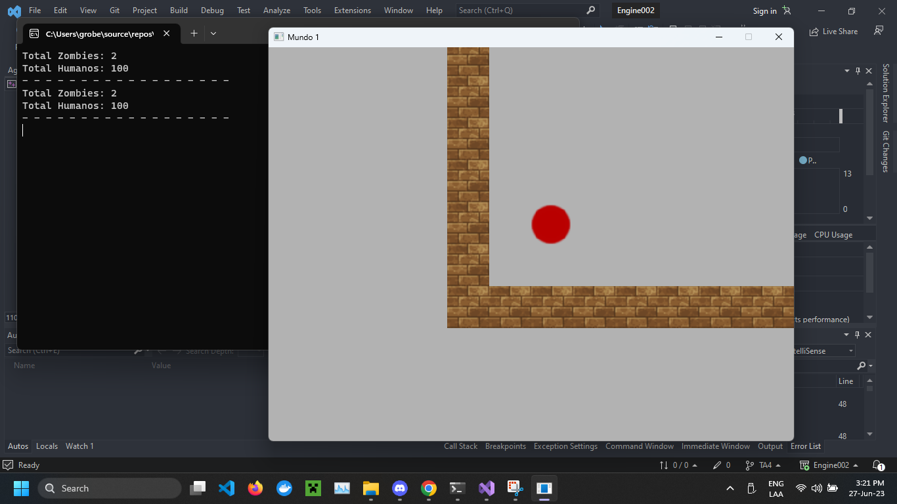

# Implementar dos variables Total Humanos y Total Zombies

* La primera vez que carga el juego total humano debe ser igual a la cantidad de humanos en escena y total zombies igual a la cantidad de zombies, cada vez que un zombie convierte a un humano en zombie los contadores se deben actualizar.
* Al presionar la tecla F se debe mostrar en consola ambos valores
* Crear branch TA4 

